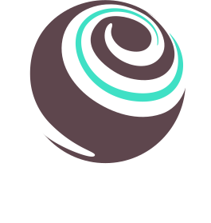
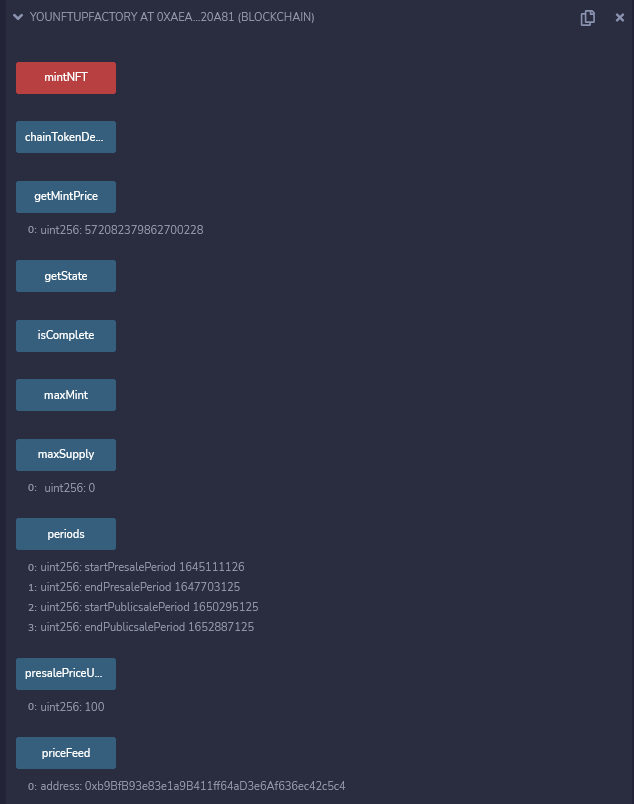

# Solidity, contrat et IPFS

Dans ce chapitre nous allons voir le language Solidity permettant l'écriture de smart contract sur la blockchain [ETH](https://ethereum.org/fr/) et plus largement toutes les blockchains compatible [EVM]

Nous verrons aussi la réalisation d'un environnement de dev local, puis l'implémentation de test sur le contrat, la blockchain ne laisse pas le droit à l'erreur il est important d'avoir un fort taux de test bien réalisés.

Puis nous aborderons l'utilisation d'[IPFS](#ipfs) afin de décentraliser les ressources vers lesquelles pointent nos tokens.

## Table of contents

1. [Rappel sur les smart contracts](#backtosmartcontract)
2. [Solidity POO pour smart contract](#whatissolidity)
   - [L'environnement de dev](#devenvironment)
     - [Ganache-CLI](#ganache)
     - [VSCode/Remix](#vscodeorremix)
     - [Truffle](#truffle)
     - [Jest/Chai](#jestandchai)
     - [Metamask](#metamask)
3. [Notre premier smart contract ERC721](#urfirstcontract)
4. [Gestion de la ressource avec IPFS](#ipfs)

## Rappel sur les smart contracts <a name="backtosmartcontract"></a>

</br>

<p align="left">Un smart contract est un programme qui contrôle des actifs numériques</p>
<p align="left">Il fige les règles d'un accord entre plusieurs parties dans la blockchain tout en assurant le transfert d'un actif, à l'instar des contrat légaux traditionnel, lorsque les conditions définies par le contrat se vérifient</p>

</br>

Ce type de contrat peut s'appliquer à de multiples domaines :

- Les assurances
- L'immobilier
- Les supply chains (UPS,La poste...)
- La finance

</br>

Les smart contract ne permettent pas uniquement d'automatiser les accords, ils les restreignent dans leurs actions.
Ce genre de contrat tant à se développer dans les domaines nécessitant par exemple d'assurer le respect de la conformité.

On peut "tout" créer avec un smart contract à l'image d'un language comme le C# cependant le coût d'éxécution et lui pris en compte lors de l'utilisation d'une fonction du code.

Il faudra donc optimiser son code au maximum afin de réduire au minimum les frais de transactions lorsque l'utilisateur contactera votre contrat

## Solidity POO pour smart contract <a name="whatissolidity"></a>

[Solidity] est un langage de programmation orienté objet de haut niveau utilisé dans l'implémentation de smart contract sur diverses blockchains, et notamment Ethereum.

C'est un langage de type statique conçu pour compilé le code Solidity en [Bytecode] afin que les contrats s'exécutent sur une [EVM] (Ethereum Virtual Machine).

<p align="center"></p>

Solidity est disponible sur les blockchains:

- [Ethereum]
- [Tendermint]
- [Tron]
- [Binance Smart Chain]

### L'environnement de dev <a name="devenvironment"></a>

La blockchain peut paraître complexe et demande un environnement de développement très complet dans notre cas nous allons avoir besoin de plusieurs logiciels/librairies/IDE:

- [Ganache](#ganache) -> Permet de simuler un noeud ethereum en local
- [VSCode/Remix](#vscodeorremix) -> Un IDE local et un IDE en ligne
- [Truffle](#truffle) -> Un environnement de développement, un cadre de test et un pipeline d'actifs (js,css...)
- [Jest/Chain](#jestandchai) -> Librairie de test et d'assertion pour tester notre contrat ou notre DAPP
- [Metamask](#metamask) -> Un wallet de crypto monnaie permettant le test de notre blockchain local

#### Ganache-CLI <a name="ganache"></a>

La ganache, ou crème ganache, ... (ok je rigole)
<br/>

<br/>
Ganache, est un outil utilisé pour simuler une blockchain en local afin de rapidement développer vos contrat sur la blockchain Ethereum:

- [Github Ganache](https://github.com/trufflesuite/ganache)
- [Documentation Ganache](https://www.trufflesuite.com/docs/ganache/overview)

Il est utilisé tout au long du cycle de développement, il permet de développer, déployer et tester votre application dans un environnement sûr et déterministe.

#### VSCode/Remix <a name="vscodeorremix"></a>

Afin de développer facilement un contrat il est conseiller de d'abord le faire sur [Remix](https://remix-project.org/) puis de l'ajouter au projet final sur [VScode](https://code.visualstudio.com/).

Pour utiliser VSCode je vous conseille d'installer l'extension portant la syntaxe Solidity dans les fichiers `.sol` -> [Solidity extension](https://marketplace.visualstudio.com/items?itemName=JuanBlanco.solidity).


Remix est un IDE en ligne qui permet de développer, déployer et administer un smart contract pour les blockchains de type Ethereum.

Remix embarque un compilateur de script Solidity et un réseau de test afin de déployer le contrat.

Remix permet aussi d'avoir accès à une interface exposant les fonctions du contrat afin de tester ces fonctions.

<br/>

Il peut être utiliser en tant que plateforme d'apprentissage, il suffit pour cela de retrouver le contrat sur la blockchain par exemple:

<p align="center"></p>

Le contrat utilisé pour générer ce NFT [Fade](https://www.sothebys.com/en/buy/auction/2021/natively-digital-a-curated-nft-sale-2/to-be-announced) est trouvable facilement avec son adresse
`0x62F5418d9Edbc13b7E07A15e095D7228cD9386c5`.

en utilisant [Blockscan](https://blockscan.com) on retrouve facilement le contrat utilisé pour Fade
([Lien du contrat](https://etherscan.io/address/0x62F5418d9Edbc13b7E07A15e095D7228cD9386c5#code#F1#L1)).

En copiant `Fade.sol` dans Remix je vais donc pouvoir avoir accès à toutes les fonctions du contrat en local.
On poura donc comprendre ce qu'il se passe derrière la fonction `tokenURI` qui retourne un gradient différent à chaque fois.

#### Truffle <a name="truffle"></a>



Truffle est un framework de développement pour Ethereum qui à pour mission de rendre le développement blockchain normalement complexe accessible à tous.

Truffle va permettre de créer des migrations afin de déploier nos contrats, mais aussi l'éxécution des tests permettant de certifier la sécurité et la qualité de ceux-ci.

Dans le monde centralisé lorsque j'éxécute un script JS c'est l'hébérgeur qui répercute le prix, dans le monde décentralisé lorsque j'éxécute une transaction avec un smart contract (donc j'éxécute le script de ce smart contract) je paye les frais en rapport avec le coût de cette fonction.

#### Jest/Chai <a name="jestandchai"></a>

[Jest](https://jestjs.io/fr/) est un framework de test JS qui va nous permettre de tester notre contrat ainsi que notre Dapp

[Chai](https://www.chaijs.com/) est une librairie JS qui va nous permettre de réaliser des assertions, c'est à dire, à la suite d'un test de vérifier les valeurs retournées.

#### Metamask <a name="metamask"></a>

[Metamask](https://metamask.io/) est un wallet (porte-monnaie) numérique, il va nous permettre de stocker nos NFT ou autre Cryptos.

Metamask va permettre la gestion des échanges sur la blockchain, l'affichage de votre solde.

Il permet de se connecter au réseau local créer par [Ganache](#ganache) afin de tester sa Dapp avant de la fournir au monde entier.

## Notre premier smart contract ERC721 <a name="urfirstcontract"></a>

Afin de réaliser notre premier smart contract et de simplifier la partie développement nous allons utiliser uniquement [Remix](https://remix.ethereum.org) dans cette partie.

### Contrat du token

Nous allons donc créer le premier NFT de Younup, pour ce faire dans Remix créer un nouveau fichier nommé `YounupNFT.sol`

On commence par importer les standards portés par OpenZeppelin et les indications utiles au compilateur: 

```solidity
// SPDX-License-Identifier: MIT
pragma solidity ^0.8.12;

// Import of ERC721 Enumerable standard
import "@openzeppelin/contracts/token/ERC721/extensions/ERC721Enumerable.sol";
// Import of Ownable standard
import "@openzeppelin/contracts/access/Ownable.sol";
// Import of Strings standard
import "@openzeppelin/contracts/utils/Strings.sol";
```

On va ensuite définir le contrat: 

```solidity
contract YounupNFT is ERC721Enumerable, Ownable {
  //uint256 variable could use Strings library, example: value.toString()
  using Strings for uint256;

  //Declare metadata of token
  // ipfsURI => Internet Protocol File Storage URI
  string public ipfsURI;
  // ipfsExt => Extension like .json
  string public ipfsExt;

  constructor(string memory _name, string memory _symbol, string memory _ipfsURI) ERC721(_name, _symbol) {
    //Require is use to check the variable value, it will throw "No IPFS URI provided" if you don't pass it
    require(byte(_ipfsURI).length > 0, "No IPFS URI provided");
    // We allocate ipfsURI to the ipfsURI passed on contract deployment
    ipfsURI = _ipfsURI;
  }

  // This function return the metadata of a given token, here it will return our ipfsURI (json metadata)
  function tokenURI(uint256 tokenId) public view virtual override returns (string memory) {
    require(_exists(tokenId), "ERC721URIStorage: URI query for nonexistent token");
    return string(ipfsURI);
  }

  // This function is use to mint (obtain, buy...) a token, it will use _safeMint from ERC721 standard
  function mint(address recipient) public onlyOwner returns(uint256) {
    uint256 tokenId = this.totalSupply();
    _safeMint(recipient, tokenId);
    return tokenId;
  }
}
```

Nous voulons vendre notre NFT à un prix fixe en $, on va alors utiliser le principe de [Price Feed](https://docs.chain.link/docs/get-the-latest-price/) de [Chainlink](https://docs.chain.link/)

Le principe est simple à l'instant donnée où l'on veut mint le NFT le smart contract va faire appelle au Price feed pour nous fournir une conversion de $ en crypto, ici nous utiliserons le token Matic de [Polygon](https://polygon.technology/) pour ses frais minimes.

`YounupNFT-priceFeed.sol`
```solidity
// SPDX-License-Identifier: MIT
pragma solidity ^0.8.12;

//Import Chainlink aggregator to call datafeed with price
import "@chainlink/contracts/src/v0.8/interfaces/AggregatorV3Interface.sol";

contract YounupNFTPriceFeed {
  // Private and immutable aggregator for security concern
  AggregatorV3Interface private immutable _aggregator;

  // We use feedAddress (address of the token) in the aggregator
  constructor(address feedAddress) {
    _aggregator = AggregatorV3Interface(feedAddress);
  }

  // Return last price of the token
  function getLatestPrice() external view returns (int) {
    // Only price not commented, we need to pass 5 arg, but we don't need the others datas
        (
          /*uint80 roundID*/,
          int price,
          /*uint startedAt*/,
          /*uint timeStamp*/,
          /*uint80 answeredInRound*/
        ) = _aggregator.latestRoundData();
        return price;
  }

  // Return the price decimals (since not all token have the same decimal we need to know it)
  function decimals() external view returns (uint8) {
    return _aggregator.decimals();
  }
}

// We add another contract so we could just deploy this one and don't need to send the token adress in the constructor since it's fixed here
contract PriceFeedMaticUSD is YounupNFTPriceFeed {
    /**
     * Network: Polygon
     * Aggregator: MATIC/USD
     * Address (mainnet): 0xAB594600376Ec9fD91F8e885dADF0CE036862dE0
     * Address (testnet): 0xd0D5e3DB44DE05E9F294BB0a3bEEaF030DE24Ada
     * From: https://docs.chain.link/docs/matic-addresses/
     */
  constructor () YounupNFTPriceFeed(0xd0D5e3DB44DE05E9F294BB0a3bEEaF030DE24Ada) {}
}
```

Afin d'appliquer des limites de mint à notre NFT, par exemple limité son émission ou encore le nombre de token autorisé par utilisateur nous allons créer ce que l'on appelle un Minter

Tout d'abord nous allons définir la structure des paramètres d'entrée du contrat.
`YounupNFT-minter.sol`
```solidity
// SPDX-License-Identifier: MIT
pragma solidity ^0.8.12;

import "./YounupNFT-priceFeed.sol"
import "./YounupNFT.sol"

struct Parameters {
    uint8 chainCurrencyDecimals; // Decimal of the token use
    uint presalePriceUSD; // First sale price in USD
    uint publicsalePriceUSD; // Seconde sale price in USD
    uint maxSupply; // Max token mintable
    uint maxMint; // Max mint by user
    Token token; // Token is the YounupNFT token
    YouNFTupPriceFeed priceFeed; // Our created pricefeed contract
    Periods periods; // We will use periods to know when it's first or second sales
    address payable teamAddress; // This is the team wallet that will receive all funds
}

struct Token {
  string name; // Token name ex: Ethereum
  string symbol; // Token symbol ex: ETH
  string ipfsURI; // Token IPFS Uri
}

struct Periods {
  // timestamp use for start and end private sale
  uint startPresalePeriod;
  uint endPresalePeriod;
  // timestamp use for start and end of public sale
  uint startPublicsalePeriod;
  uint endPublicsalePeriod;
}
```

Maintenant que nous avons définis les structures qui permettront d'utiliser et sécuriser notre contrat on peut écrire le reste:

```solidity
contract YounupNFTMinter {
  // We use it so we could now at wich state we are
  enum State
  {
    waitingPeriod, // no mint possible
    presalePeriod, // Mint with the private sale price
    publicsalePeriod, // Mint with the public sale price
    complete // All items are minted no more mint possible or you have outdated the endPublicSalePeriod
  }

   // Chain info and team wallet
  uint8 public immutable chainTokenDecimals;
  address payable public immutable teamAddress;
  YounupNFT public immutable token;

  //NFT max supply
  uint public immutable maxSupply;

  //NFT max mint per wallet
  uint public immutable maxMint;

  // NFT price in USD
  uint public immutable presalePriceUSD;
  uint public immutable publicsalePriceUSD;
  uint constant ticketPriceDecimals = 2;

  //Periods
  Periods public periods;

  //Chainlink Price feed
  YounupNFTPriceFeed public immutable priceFeed;

   constructor(Parameters memory params) {
     // Many test use to ensure that the periode are logics
      require(params.periods.startPresalePeriod > block.timestamp, "Invalid timestamp: startPresalePeriod");
      require(params.periods.endPresalePeriod > params.periods.startPresalePeriod, "Invalid timestamp: endPresalePeriod");
      require(params.periods.startPublicsalePeriod > params.periods.endPresalePeriod, "Invalid timestamp: startPublicsalePeriod");
      require(params.periods.endPublicsalePeriod > params.periods.startPublicsalePeriod, "Invalid timestamp: endPlubicsalePeriod");

      // We create the contract for the Token here
      token = new YounupNFT(this, params.token.name, params.token.symbol, params.token.ipfsURI);

      chainTokenDecimals = params.chainCurrencyDecimals;
      presalePriceUSD = params.presalePriceUSD;
      publicsalePriceUSD = params.publicsalePriceUSD;
      maxSupply = params.maxSupply;
      maxMint = params.maxMint;
      priceFeed = params.priceFeed;
      periods = params.periods;

      teamAddress = params.teamAddress;
    }
}
```

Notre contrat est maintenant initialiser mais il reste encore à mettre en place la possibilité de mint au prix voulu :

```solidity
  function mintNFT() external payable {
    // Check if contract is in state where you could mint
    require(getState() == State.presalePeriod || getState() == State.publicsalePeriod, "You can't mint it right now");

    // Get the mint price from priceFeed and ensure everything is ok with all limits and price passed
    uint entryPrice = getMintPrice();
    require(msg.value >= entryPrice, "Not enough funds to mint YouNFTup. See getMintPrice()");
    require(token.totalSupply() < maxSupply, "Too much NFT minted");
    require(token.balanceOf(msg.sender) < maxMint, "You could mint only 1 YouNFTup");

    // Mint the token using the YounupNFT mint function
    token.mint(msg.sender);
    // We also transfer all the fund sent to the contract to the team wallet
    teamAddress.transfer(address(this).balance);
  }

  // Function use to get the current state of the contract
  function getState() public view returns(State) {
    if (block.timestamp < periods.startPresalePeriod) {
        return State.waitingPeriod;
    }
    if (block.timestamp < periods.endPresalePeriod) {
        return State.presalePeriod;
    }
    if (block.timestamp < periods.startPublicsalePeriod) {
        return State.waitingPeriod;
    }
    if (block.timestamp < periods.endPublicsalePeriod) {
        return State.publicsalePeriod;
    }
    return State.complete;
  }

  // Function use to get the mint price using priceFeed.getLatestPrice()
  function getMintPrice() public view returns(uint) {
    int latestPrice = priceFeed.getLatestPrice();
    uint256 ticketPriceUSD = publicsalePriceUSD;
    if (getState() == State.presalePeriod) {
        ticketPriceUSD = presalePriceUSD;
    }
    
    uint latestPriceAdjusted = uint(latestPrice) * 10 ** (chainTokenDecimals - priceFeed.decimals());

    uint entryPrice = 10 ** (chainTokenDecimals * 2) * ticketPriceUSD / latestPriceAdjusted / (10 ** ticketPriceDecimals);
    return entryPrice;
  }

  // Function to check if the contract is complete or no
  function isComplete() public view returns(bool) {
    return getState() == State.complete;
  }
```

Il nous faut aussi mettre à jour le token car nous utilisons maintenant un minter, comme vu à la ligne suivante:
`token = new YounupNFT(this, params.token.name, params.token.symbol, params.token.ipfsURI);`
this équivaut ici à `YounupNFTMinter`

`YounupNFT.sol`
```solidity
import "./YounupNFTMinter.sol"

...

constructor(YouNFTupMinter _minter, ...) {
  minter = _minter;
}
```

La fonction mint étant `public onlyOwner` seul le contrat Minter pourra minter un token YounupNFT

Il ne nous reste plus qu'à déployer notre contrat pour simplifier cette partie je réalise une factory qui crée le constructor plutôt que de le déclarer au déploiement.

`YounupNFT-factory.sol`
```solidity
// SPDX-License-Identifier: MIT
pragma solidity ^0.8.12;

import "./YouNFTup-minter.sol";

contract YouNFTupFactory is YouNFTupMinter {
  constructor() YouNFTupMinter(Parameters({
      chainCurrencyDecimals: 18,
      presalePriceUSD: 100,
      publicsalePriceUSD: 200,
      maxSupply: 42,
      maxMint: 1,
      token: Token({
          name: "YouNFTup",
          symbol: "YNP",
          ipfsURI: "https://ipfs.io/ipfs/bafkreihmkaetjsqkb2cnzdkyhvpattzpj7duuqj4kfvtx3qfcitj2didbu"
      }),
      priceFeed: new PriceFeedMaticUSD(),
      periods: Periods({
          startPresalePeriod: block.timestamp + 1,
          endPresalePeriod: block.timestamp + 3600 * 24 * 30,
          startPublicsalePeriod: block.timestamp + 3600 * 24 * 60,
          endPublicsalePeriod: block.timestamp + 3600 * 24 * 90
      }),
      teamAddress: payable(0xB677dd9Ae9217Fbb4E3d072b9F7F68947C2a4AA6)
  })) {}
}
```

Plus qu'à compiler notre contrat et le déployer sur le réseau de test matic (pour ajouter le réseau c'est [ici](https://docs.polygon.technology/docs/develop/metamask/config-polygon-on-metamask/))

Dans la partie "Solidity Compiler" de remix il faut choisir la version du compiler 0.8.12 puis compiler le contrat `YounupNFT-factory.sol` qui importe tous les autres.

Si vous avez bien installer Metamask et que vous avez ajouter le réseau `Matic Mumbai` nous allons maintenant déployer notre contrat.

Dans la partie "Deploy & run transactions" de Remix, il faut choisir pour Environment "Injected Web3", vous aurez alors une notification Metamask pensez à bien vérifier que vous êtes sur le testnet de polygon avant de déployer.

On séléctionne ensuite le contrat `YounupNFT-factory` puis on clique sur "Deploy", une transaction va alors apparaître sur votre Metamask si vous l'acceptez vous aller payer les fee de déploiement d'un contrat (sur testnet donc gratuit)

Vous aurez alors accès à toutes les fonctions de votre contrat pour pouvoir le tester

<p align="center"></p>

## Gestion de la ressource avec IPFS <a name="ipfs"></a>

</br>
</br>
<p align="center">
<a href="./WhatIsNFT.md">C'est quoi un NFT ?</a>&nbsp;&nbsp;&nbsp;|&nbsp;&nbsp;&nbsp;
<a href="../../README.md">Retour au sommaire</a>&nbsp;&nbsp;&nbsp;|&nbsp;&nbsp;&nbsp;<a href="./CreateUrDapp.md">Créer une application décentralisée (DAPP)</a>
</p>

<!-- LINK -->

[solidity]: https://docs.soliditylang.org/en/v0.8.9/ "Solidity"
[evm]: https://ethereum.org/en/developers/docs/evm/ "EVM"
[bytecode]: https://fr.wikipedia.org/wiki/Bytecode "Bytecode"
[ethereum]: https://ethereum.org/en/ "Ethereum"
[tendermint]: https://tendermint.com/ "Tendermint"
[tron]: https://tron.network/ "Tron"
[binance smart chain]: https://academy.binance.com/fr/articles/an-introduction-to-binance-smart-chain-bsc "Binance Smart Chain"
