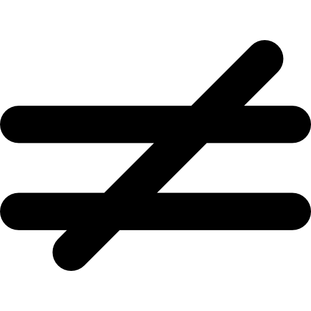

# C'est quoi un NFT ?

Dans ce chapitre nous allons voir ce qu'est un NFT dans les grandes lignes, les utilitées de ce genre de technologie.

Nous aborderons ensuite la norme ERC721, et le fonctionnement général d'un smart contract gérant des NFT.

Puis nous rentrons plus en détails dans l'implémentation proposé par [EIP] d'un token au norme ERC721

## Table of contents

1. [Qu'est ce qu'un NFT ?](#wathisnft)
   - [Définition de fongible](#fongible)
   - [Alors c'est quoi exactement ?](#sowhatisit)
   - [Pourquoi utiliser un NFT ?](#whyusenft)
   - [Les normes NFT](#nftnorms)
     - [La norme ERC-721](#nfterc721)
     - [La norme ERC-1155](#nfterc1155)
2. [Fonctionnement général](#generalfunc)
   - [Propriétaire, opérateur et approbation](#useroperatorapprob)
3. [ERC-721 en détail](#erc721detail)
   - [Son interface](#erc721isinterface)
   - [ERC721 Functions/Events](#erc721funcevents)
   - [ERC721Metadata](#erc721metadata)
   - [ERC721Receiver](#erc721receiver)
   - [Comment ça marche ?](#erc721howitsworks)
4. [Mot de la fin](#end)

<br/>

## Qu'est ce qu'un NFT ? <a name="wathisnft"></a>

Un NFT ou jeton non fongible (Non-Fungible Token) est un type de token cryptographique

<br/>

> <p align="center" style="padding: 1rem;">
> <br/> Le mot <strong>token</strong> peut représenter le <strong>contrat</strong> qui contient une collection ou bien <strong>le token numéro X</strong> de cette collection
> </p>

<br/>

### Définition de fongible <a name="fongible"></a>

> Se dit de choses qui se consomment par l'usage et qui peuvent être remplacées par des choses de même nature, de même qualité et de même quantité (par exemple denrées, argent comptant).

<br/>

Exemple: <br/>

<p style="padding-left: 1rem">une pièce d'un euro est interchangeable avec une autre pièce de un euro. Il en va de même des valeurs mobilières et, à plus forte raison, quand elles sont dématérialisées. En revanche, un appartement dans un immeuble ou une œuvre d'art sont des corps certains</p>
<br/>
<div align="center">

| Fongible                                                                                                                                                                                                                                                                                                                                                                                                                                                                                                                                                                                                                                                                                                                                                                    | Non fongible                                                                                                                                                                                                                                                                                                                                                                                                                                                                                                                                                                                                                                                                                                                                                                                           |
| --------------------------------------------------------------------------------------------------------------------------------------------------------------------------------------------------------------------------------------------------------------------------------------------------------------------------------------------------------------------------------------------------------------------------------------------------------------------------------------------------------------------------------------------------------------------------------------------------------------------------------------------------------------------------------------------------------------------------------------------------------------------------- | ------------------------------------------------------------------------------------------------------------------------------------------------------------------------------------------------------------------------------------------------------------------------------------------------------------------------------------------------------------------------------------------------------------------------------------------------------------------------------------------------------------------------------------------------------------------------------------------------------------------------------------------------------------------------------------------------------------------------------------------------------------------------------------------------------ |
| <br/><div style="display: flex; align-items:center">&nbsp;&nbsp;&nbsp;&nbsp;</div><br/><div style="display: flex; align-items:center">&nbsp;&nbsp;&nbsp;&nbsp;</div><br/><div style="display: flex; align-items:center">&nbsp;&nbsp;&nbsp;&nbsp;</div> | <br/><div style="display: flex; align-items:center">&nbsp;&nbsp;&nbsp;&nbsp;</div><br/><div style="display: flex; align-items:center">&nbsp;&nbsp;&nbsp;&nbsp;</div><br/><div style="display: flex; align-items:center">&nbsp;&nbsp;&nbsp;&nbsp;</div> |

</div>
<br/>
<br/>

### Alors c'est quoi exactement ? <a name="sowhatisit"></a>

Un NFT, étant non fongible, il permet de représenter un objet numérique, l'objet peut être une image, une vidéo, un fichier audio ou encore un fichier texte...

L'authentification d'un NFT est validée grâce au protocole d'une blockchain qui lui attribue sa première valeur.

Un NFT n'est pas interchangeable, cela le rend différent des cryptos-monnaies comme le Bitcoin ou l'Ethereum qui sont fongibles et interchangeables par nature.

Un NFT est indivisible, non intéropérable, indestructible et vérifiable c'est donc l'une des sources d'informations les plus surs de nôtre temps, en terme de preuve ,tout ce qui est fait sur la blockchain est inscrit.

<br/>

### Pourquoi utiliser un NFT ? <a name="whyusenft"></a>

Un NFT par son authentification sur la blockchain permet de vérifier sa rareté numérique, le propriétaire ou encore les propriétaire au cours du temps...
Ils peuvent être utilisés dans de nombreux cas aujourd'hui cette technologie se développe rapidement et touche aux secteurs de l'art, des objets de collection, des jeux ou encore de la photo.

On pourrait imaginer à l'avenir aussi bien plus d'applications comme la gestion de l'identité, la gestion des héritages...

<br/>

### Les normes NFT <a name="nftnorms"></a>

La blockchain étant un système "récent" il existe de nombreuses normes qui visent à aider à la construction de token dans le cas du NFT il existe actuellement deux normes.

<br/>

#### La norme ERC-721 <a name="nfterc721"></a>

ERC-721 est la première norme créer pour représenter un actif numérique non fongible, il se base sur les recommandations [EIP] (Ethereum Imporvement Proposals), il permet de décrire un seul type de token à la fois.
C'est un standard pour les contrats [Solidity] il est héritable il permet donc aux développeurs de facilement créer de nouveaux contrats conformes à cette norme via l'intermédiaire de la bibliothèque [OpenZeppelin]

<br/>

#### La norme ERC-1155 <a name="nfterc1155"></a>

ERC-1155 est un nouveau concept qui apporte au monde du NFT le principe de semi-fongibilité, c'est un contract qui étend les fonctionnalités de la norme ERC-721. Il permet de gérer plusieurs tokens comme s'il s'agissait de token ERC-20 ou ERC-721, ou les deux en même temps sous la même adresse de contrat.

<br/>

## Fonctionnement général <a name="generalfunc"></a>

<br/>

Le smart contract ERC-721 est un ensemble de scripts permettant la gestion d'un ensemble de token de même type, il contient:

- La liste des tokens créés
- Les propriétaires d'un ou plusieurs tokens
- Les personnes ayant droit sur la gestion d'un token
- Les données spécifiques à l'objet (NFT) représenter

Les interactions avec un NFT se font au moyen de transactions inscritent sur la blockchain.

### Propriétaire, opérateur et approbation <a name="useroperatorapprob"></a>

Le propiétaire d'un token a pleins pouvoirs sur celui-ci, il peut le détruire, le transférer ou encore déléguer son droit.

La norme ERC-721 permet de définir un principe de délégation :

- via une adresse approuvée
- via un opérateur approuvée

Il permet aux différentes personnes (adresses) d'avoir un droit permettant la gestion de ses tokens, ce principe de délégation permet par exemple aux marketplaces de gérer les échanges de NFT entre propriétaires et acheteurs

<br/>

## ERC-721 en détail <a name="erc721detail"></a>

Nous allons voir en détail le fonctionnement d'un contrat via la norme ERC-721 et notamment ce qu'il est possible de faire avec

### Son interface <a name="erc721isinterface"></a>

<br/>

```javascript
pragma solidity ^0.8.0;

interface IERC721 is IERC165 {
   event Transfer(address indexed from, address indexed to, uint256 indexed tokenId);
   event Approval(address indexed owner, address indexed approved, uint256 indexed tokenId);
   event ApprovalForAll(address indexed owner, address indexed operator, bool approved);
   function balanceOf(address owner) external view returns (uint256 balance);
   function ownerOf(uint256 tokenId) external view returns (address owner);
   function safeTransferFrom(address from, address to,uint256 tokenId) external;
   function safeTransferFrom(address from, address to, uint256 tokenId, bytes calldata data) external;
   function transferFrom(address from, address to,uint256 tokenId) external;
   function approve(address to, uint256 tokenId) external;
   function getApproved(uint256 tokenId) external view returns (address operator);
   function setApprovalForAll(address operator, bool _approved) external;
   function isApprovedForAll(address owner, address operator) external view returns (bool);
}
```

<br/>

### ERC721 Functions/Events <a name="erc721funcevents"></a>

| Function/Event                | Paramètres                                                                                                                                                             | Description                                                                                                                                                                                                           |
| ----------------------------- | ---------------------------------------------------------------------------------------------------------------------------------------------------------------------- | --------------------------------------------------------------------------------------------------------------------------------------------------------------------------------------------------------------------- |
| function `balanceOf `         | - `_owner` = adresse d'un owner                                                                                                                                        | fournit le nombre de tokens du NFT possédés par l'utilisateur                                                                                                                                                         |
| function `ownerOf`            | - `_tokenId` = id d'un token                                                                                                                                           | renvoie l'adresse du propriétaire du token pour un id donné                                                                                                                                                           |
| function `safeTranferFrom`    | - `from` = adresse de départ </br> - `to` = adresse d'arrivée </br> `tokenId` = id du token </br> `_data` **optionnel** = données libres fournies pendant le transfert | Permet de réaliser un tranfert de token d'une adresse à une autre, cette fonction vérifie la capacité technique du destinataire à recevoir le token                                                                   |
| function `transferFrom`       | - `from` = adresse de départ </br> - `to` = adresse d'arrivée </br> `tokenId` = id du token                                                                            | Réalise la même action que `safeTransferFrom` sans la vérification de la capacité technique du destinataire à recevoir le token                                                                                       |
| event `Transfer`              | - `from` = adresse de départ </br> - `to` = adresse d'arrivée </br> `tokenId` = id du token                                                                            | **L'événement doit être émis lors de l'appel aux fonctions:** </br> - `safeTransferFrom` </br> - `transferFrom`                                                                                                       |
| function `approve`            | - `approved` = adresse à approuver </br> - `tokenId` = id du token à approuver                                                                                         | Permet d'accorder le droit à un utilisateur autre que le propriétaire du token de le transférer </br> **_ce droit doit être reset lors d'un transfert_** </br> le droit de transfert n'est autorisé que pour un token |
| event `Approval`              | - `owner` = propriétaire du token </br> - `approved` = adresse à approuver </br> - `tokenId` = un du token à approuver                                                 | **L'événement doit être émis lors de l'appel à:** `approve` afin d'historiser l'opération                                                                                                                             |
| function `getApproved`        | - `tokenId` = id du token                                                                                                                                              | Retourne l'adresse de l'utilisateur ayant droit autre que le propriétaire sur le token à l'id donné                                                                                                                   |
| function `setApprovalForAll`  | - `operator` = adresse à aprouver </br> - `_approved` = booléen pour approuver ou désapprouver                                                                         | Permet à un propriétaire de token de donner le droit à une adresse de transférer la **totalité** de ses tokens                                                                                                        |
| event `ApprovalForAll`        | - `owner` = propriétaire des tokens </br> - `operator` = adresse à aprouver </br> - `approved` = booléen pour approuver ou désapprouver                                | **L'événement doit être émis lors de l'appel à:** `setApprovalForAll` afin d'historiser l'opération                                                                                                                   |
| function `isApprovedForAll`   | - `owner` = adresse du propriétaire </br> - `operator` = adresse à vérifier                                                                                            | Retourne un booléen qui permet de savoir si l'adresse de l'opérateur est approuvée à transférer tous les tokens du propriétaire                                                                                       |
| function `_exists`            | - `tokenId` = id d'un token                                                                                                                                            | Retourne si le token éxiste pour un id donné                                                                                                                                                                          |
| function `_isApprovedOrOwner` | - `spender` = adresse d'un utilisateur </br> - `tokenId` = l'id d'un token                                                                                             | Retourne si l'adresse donnée peut transférer le token                                                                                                                                                                 |
| function `_safeMint`          | - `to` = adresse du destinataire </br> `tokenId` = l'id d'un token </br> `_data` **optionnel** = données libres fournies pendant le transfert                          | Fonction permettant de mint un token en toute sécurité, la fonction vérifie que l'adresse de destination implémente <a href="#erc721receiver">`onERC721Received`</a> afin de créer notre NFT                          |
| function `_mint`              | - `to` = adresse du destinataire </br> `tokenId` = l'id d'un token                                                                                                     | Fonction permettant de créer un NFT et l'attribuer à une adresse </br> Réalise la même action que `_safeMint` sans la vérification de la capacité technique du destinataire à recevoir le token                       |
| function `_burn`              | - `owner` **optionnel** = adresse du propriétaire </br> - `tokenId` = id d'un token                                                                                    | Fonction permettant de "détruire" un token, celui-ci existera toujours sur la blockchain mais sera considéré comme brulé                                                                                              |

<br/>

### ERC721Metadata <a name="erc721metadata"></a>

L'interface `ERC721Metadata` à été créer avec l'objectif de permettre de lier à un token ERC-721 des données spécifiques:

- Le nom du token (exemple: Bitcoin, Ethereum ...)
- Le symbole du token (exemple: BTC, ETH ...)
- Le tokenURI, un url qui renvoie vers la ressource
  - cette ressource sera hébergée en dehors de la blockchain il est donc important de regarder du côté de l'internet décentralisé avec par exemple la technologie [IPFS](./SolidityAndContract.md#ipfs) (InterPlanetary File System)

Afin d'implémenter cette interface notre token ERC-721 se doit d'implémenter [ERC-165] qui lui permet d'indiquer les différentes interfaces qu'il supporte.

```javascript
pragma solidity ^0.8.0;

interface IERC721Metadata is IERC721 {
    function name() external view returns (string memory);
    function symbol() external view returns (string memory);
    function tokenURI(uint256 tokenId) external view returns (string memory);
}
```

Notre token sera donc de classe [ERC721Metadata] il implémentera :

| Function/Event          | Paramètres                                                                      | Description                                                                                |
| ----------------------- | ------------------------------------------------------------------------------- | ------------------------------------------------------------------------------------------ |
| function `name`         |                                                                                 | Retourne le nom du token                                                                   |
| function `symbol`       |                                                                                 | Retourne le symbole du token                                                               |
| function `tokenURI`     | - `tokenId` = L'id d'un token                                                   | Retourne l'URI de la ressource distante d'un token pour un id donné, peut être vide        |
| function `_setTokenURI` | - `tokenId` = id du token </br> - `tokenURI` = URI distant à attribuer au token | Permet de définir l'URI pour un token                                                      |
| function `_setBaseURI`  | - `baseURI` = URI utilisé pour prefix                                           | Permet lorsque l'on utilise la fonction `tokenURI` de préfixer avec le paramètre `baseURI` |
| function `baseURI`      |                                                                                 | Retourne le baseURI définie dans le contrat                                                |

<br/>

### ERC721Receiver <a name="erc721receiver"></a>

Lors d'un transfert de notre NFT d'un utilisateur à un autre, il n'existe pas de problème particulier, l'utilisateur qui envoie verra le NFT disparaître de son wallet, la transaction historisée, et le destinataire obtiendra le token dans son wallet il sera ensuite le nouveau propriétaire.

Cependant il est impossible de transférer celui-ci à un autre contrat sans avoir l'assurance qu'il ne sera pas perdu c'est là où [ERC721Receiver] intervient.

Notre contrat `ERC721` va s'appuyer sur cette interface afin de permettre de vérifier si le contrat de destination, lors d'un transfert, à la capacité de recevoir nos tokens.
Le contrat de destination ce doit lui aussi d'implémenter cette interface pour certifier sa capacité à recevoir nos tokens.

Cette interface n'apporte cependant pas la garantie que tout se passera bien pour votre NFT, elle garantie seulement que le contrat de destination a pris les mesures afin que le transfert puisse être réalisé.

```javascript
pragma solidity ^0.8.0;

interface IERC721Receiver {

   function onERC721Received(address operator, address from, uint256 tokenId, bytes calldata data) external returns (bytes4);
}
```

| Function/Event              | Paramètres                                                                                                                                  | Description                                                                                                                   |
| --------------------------- | ------------------------------------------------------------------------------------------------------------------------------------------- | ----------------------------------------------------------------------------------------------------------------------------- |
| function `onERC721Received` | `operator` = adresse de destination </br> `from` = adresse de départ </br> `tokenId` = id d'un token </br> `data` = données supplémentaires | Cette fonction permet au contrat d'assurer aux autres contrat qu'il est en capacité de recevoir un token dans la norme ERC721 |

<br/>

### Comment ça marche ? <a name="erc721howitsworks"></a>

L'objectif de notre smart contract voulant définir un NFT doit implémenter la norme ERC721, afin de permettre de réaliser des échanges d'objets digitaux sur la blockchain, en résumé plusieurs règles s'imposent :

- Les tokenId utilisés doivent exister
- Seul le propriétaire peut accorder des droits
- Seul le propriétaire ou un utilisateur autorisé peut transférer un token
- Un token ne peut pas être transféré au propriétaire qui le détient
- Un token ne doit pas être transféré à l'adresse `0x0` sous risque de destruction

Libre à vous ensuite d'implémenter ce que vous voulez.

<br/><br/>

## Mot de la fin <a name="end"></a>

<br/>

Dans la suite de ce tutoriel nous allez voir comment réaliser un contrat, gérant une collection de NFT hébergée sur [IPFS] au format JSON, nous partirons d'un exemple simple de contrat permettant:

- La création de token NFT
- La gestion des metadata
- L'affichage de tous les tokens
- L'affichage d'un token

</br>
<br/>
<p align="center">
<a href="../../README.md">Retour au sommaire</a>&nbsp;&nbsp;&nbsp;|&nbsp;&nbsp;&nbsp;<a href="./SolidityAndContract.md">Solidity, contrat et IPFS</a>
</p>

<!-- LINK -->

[eip]: https://eips.ethereum.org "EIP"
[solidity]: https://soliditylang.org/ "Solidity"
[openzeppelin]: https://openzeppelin.com/ "OpenZeppelin"
[erc-165]: https://eips.ethereum.org/EIPS/eip-165 "ERC-165"
[erc721metadata]: https://docs.openzeppelin.com/contracts/2.x/api/token/erc721#ERC721Metadata "ERC721Metadata"
[erc721receiver]: https://docs.openzeppelin.com/contracts/2.x/api/token/erc721#IERC721Receiver "ERC721Receiver"
[ipfs]: ./SolidityAndContract.md#ipfs "IPFS"
