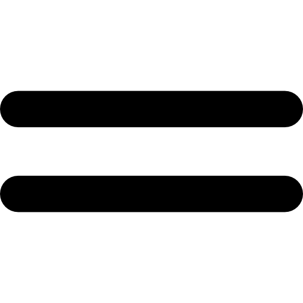

# C'est quoi un NFT ?

## Introduction

Vous avez déjà entendue parler de blockchain ?
De bitcoin ou encore d'ethereum voir même de BNB ?
Alors cet article est fait pour vous sinon je vous invite à voir la définition de la blockchain proposé:

- par le gouvernement [ici](https://www.economie.gouv.fr/entreprises/blockchain-definition-avantage-utilisation-application)
- par Blockchain France [ici](https://blockchainfrance.net/decouvrir-la-blockchain/c-est-quoi-la-blockchain/)

## Définition

Avant de parler de NFT, il faut aborder la notion de fongibilité pour en comprendre sa définition.

### Fongible

> Se dit de choses qui se consomment par l'usage et qui peuvent être remplacées par des choses de même nature, de même qualité et de même quantité (par exemple denrées, argent comptant).

Exemple:

une pièce d'un euro est interchangeable avec une autre pièce de un euro.
Il en va de même des valeurs mobilières et, à plus forte raison, quand elles sont dématérialisées.
En revanche, un appartement dans un immeuble ou une œuvre d'art sont des corps certains

| Fongible                                                                                                                                                                                                                                                                                                                                                                                                                                                                                                                                                                                                                                                                                                                                                                    | Non fongible                                                                                                                                                                                                                                                                                                                                                                                                                                                                                                                                                                                                                                                                                                                                                                                           |
| --------------------------------------------------------------------------------------------------------------------------------------------------------------------------------------------------------------------------------------------------------------------------------------------------------------------------------------------------------------------------------------------------------------------------------------------------------------------------------------------------------------------------------------------------------------------------------------------------------------------------------------------------------------------------------------------------------------------------------------------------------------------------- | ------------------------------------------------------------------------------------------------------------------------------------------------------------------------------------------------------------------------------------------------------------------------------------------------------------------------------------------------------------------------------------------------------------------------------------------------------------------------------------------------------------------------------------------------------------------------------------------------------------------------------------------------------------------------------------------------------------------------------------------------------------------------------------------------------ |
|  
&nbsp;&nbsp;&nbsp;&nbsp;
 
&nbsp;&nbsp;&nbsp;&nbsp;
 
&nbsp;&nbsp;&nbsp;&nbsp;
 |  
&nbsp;&nbsp;&nbsp;&nbsp;
 
&nbsp;&nbsp;&nbsp;&nbsp;
 
&nbsp;&nbsp;&nbsp;&nbsp;
 |

### NFT

Les NFT (Non Fungible Token) ou Token Non Fongible, sont des actifs numériques, que l'on peut apparenter à des certificats d'authenticité, émis par une blockchain.

Par exemple, dans le tableau expliquant le principe de fongibilité, les deux chats sont des NFT représentant chacun un [CryptoKitties](https://www.cryptokitties.co/).

Les NFT possédent plusieurs propriétés:

- **Unicité** : Elle permet de le définir à l'aide de métadonnées qui le décrivent et le distingue des autres.

- **Rareté**: Elle est établie par le fait que notre actif soit unique, un NFT ne peut être définie qu'une seule fois sur la blockchain. Cela crée donc un principe de rareté qui lui donne sa valeur
   
  _exemple: Le bitcoin a sa rareté défini par son nombre de token limité, on peut définir autant de NFT que l'on veut dans une collection, mais chaque NFT de cette collection sera unique_

- **Indivisibilité**: Il est impossible de diviser un NFT, si on prend l'exemple d'un NFT représentant un billet de train, il n'est pas admissible qu'un utilisateur l'achète 10% de son prix.

## Pourquoi utiliser un NFT

Là ou les cryptomonnaies répondent au suivi d'actif, les NFT répondent au besoin d'un suivi d'actif unique.

Les NFT trouvent tout leurs sens dans l'économie numérique et couvre un large spectre d'applications:

- Les objets de collection
- L'art physique et numérique
- Objets de jeu vidéo (on peut citer CS:GO avec des skins allant à plusieurs dizaines de milliers d'euros, eux centralisés par Valve)
- Objets dans un monde virtuel (metaverse)
- Actifs physique: maison, voiture, bateau, avion..
- Identité et dossier médicaux
- Assurance
- Héritage

En bref tout est imaginable à partir du moment où l'on veut représenter numériquement un actif.
Afin qu'il soit unique tout en gardant les propriétés de la blockchain non modifiables, non falsifiables, vérifiables.
Cela permet donc la gestion d'un actif par un contrat figé avec des règles de transfert de cet actif établis.

## Fonctionnement général et norme

Un NFT est un token, il est donc relié à un smart contract.

A la différence d'un contrat légal traditionnel (ex: contrat d'assurance) qui définit les règles d'un accord entre plusieurs parties, un smart contract lui va figer les règles dans la blockchain tout en assurant le transfert de l'actif concerné lorsque les conditions contractuelles se vérifient.

On peut donc dire qu'un NFT est lié à un smart contract lui-même stocké dans une blockchain.

Dans un objectif de normalisation [OpenZeppelin](https://docs.openzeppelin.com/openzeppelin/) et la communauté ETH ([Ethereum Improvement Proposals](https://eips.ethereum.org/)) ont proposés deux normes : [ERC-721](https://docs.openzeppelin.com/contracts/4.x/erc721) et [ERC-1155](https://docs.openzeppelin.com/contracts/4.x/erc1155)

Là où les normes ERC-20 et ERC-777 répondent au besoin de suivi d'un token fongible.
ERC-721 lui permet l'implémentation d'un token non fongible.
Pour ERC-1155 il permet la gestion de token fongible et non fongible nous n'aborderons pas le sujet dans cet article.

## ERC-721

Le smart contract ERC-721 est un ensemble de scripts permettant la gestion d'un ensemble de token de même type, il contient:

- La liste des tokens créés
- Les propriétaires d'un ou plusieurs tokens
- Les personnes ayant droit sur la gestion d'un token
- Les données spécifiques à l'objet (NFT) représenter

Les interactions avec un NFT se font au moyen de transactions inscritent sur la blockchain.

## Propriétaire, opérateur et approbation

Le propiétaire d'un token a pleins pouvoirs sur celui-ci, il peut le détruire, le transférer ou encore déléguer son droit.

La norme ERC-721 permet de définir un principe de délégation :

- via une adresse approuvée (0x08agea6486...)
- via un opérateur approuvé (ex: [Binance](https://www.binance.com/fr))

Il permet aux différentes personne (adresses) d'avoir un droit permettant la gestion des tokens.
Ce principe de délégation permet par exemple aux marketplaces de gérer les échanges de NFT entre propriétaires et acheteurs.

## Conclusion

Le NFT est un outil numérique qui va prendre de plus en plus de place dans le monde de demain.
En effet en dehors du secteur de l'art en pleine ébullition, aujourd'hui beaucoup d'entreprises prennent ce virage à l'image de Facebook qui va créer son propre [Metaverse](https://about.fb.com/news/2021/10/facebook-company-is-now-meta/) (centralisé attention) ou encore [Audius](https://audius.co/) société française qui se rêve en Spotify killer.

Beaucoup de projet se base sur le NFT en tant que preuve de confiance permettant de donner accès à des logiciels/site/applications aux détenteurs d'un NFT.
Comme par exemple [EvilKids](https://evilkids.art) et attendant vous pouvez toujours aller admirer [mon musée 3D](https://nfteyez.global/accounts/DPLQ2CsCpSd8ZHYZ9ukFsokE9cpVhgN6L9D6ihfetgqN/3dgallery) ou encore mon projet [SpaceTombo](https://devpost.com/software/del-decentralized-lottery) vainqueur du [Hackathon Chainlink - Winter 2021](https://chainlink-fall-hackathon-2021.devpost.com/)
